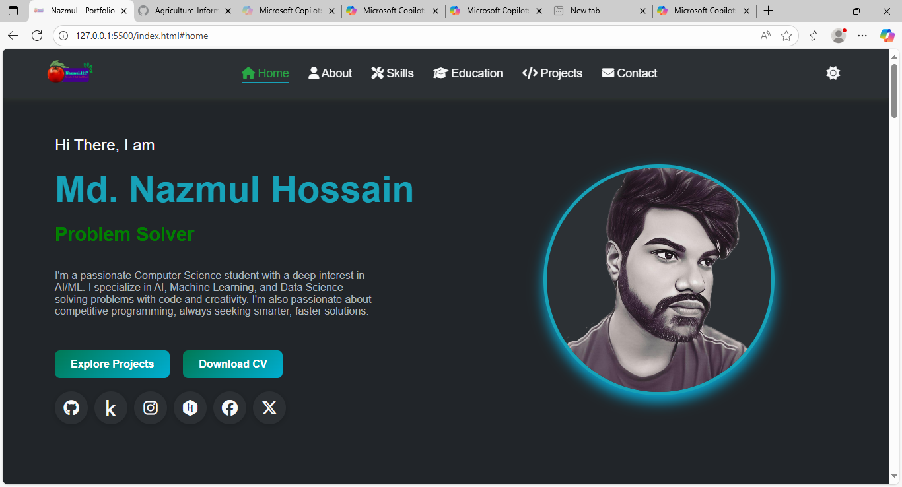
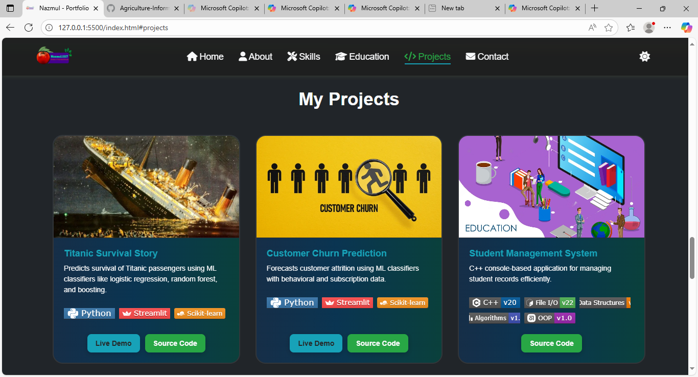

# 🌐 Md. Nazmul Hossain — Developer Portfolio

[](https://github.com/nazmul-1117/nazmul-1117.github.io/blob/main/CHANGELOG.md)
[](https://github.com/nazmul-1117/nazmul-1117.github.io)
[](https://github.com/nazmul-1117/nazmul-1117.github.io/issues)
[](https://github.com/nazmul-1117/nazmul-1117.github.io)
[](https://github.com/nazmul-1117/nazmul-1117.github.io)
[](https://github.com/nazmul-1117/nazmul-1117.github.io)
[](https://github.com/nazmul-1117/nazmul-1117.github.io)
[](LICENSE)


> A modern, responsive personal portfolio site built using HTML, CSS, and JavaScript — showcasing my projects, skills, and resume with smooth animations, theme switching, and clean design. Ideal for employers, collaborators, or anyone curious about my work in ML, AI, and Data Science.

---

## 📚 Table of Contents

- [🌐 Md. Nazmul Hossain — Developer Portfolio](#-md-nazmul-hossain--developer-portfolio)
  - [📚 Table of Contents](#-table-of-contents)
  - [🚀 Live Demo](#-live-demo)
  - [📸 Preview](#-preview)
    - [🏠 Home Page](#-home-page)
    - [💼 Projects Section](#-projects-section)
  - [✨ Features](#-features)
  - [🛠️ Tech Stack](#️-tech-stack)
  - [📁 Folder Structure](#-folder-structure)
  - [🧪 How to Run Locally](#-how-to-run-locally)
  - [📊 GitHub Stats](#-github-stats)
  - [🔮 Future Improvements](#-future-improvements)
  - [🤝 Contributing](#-contributing)
  - [📄 License](#-license)
  - [🌍 Let's Connect](#-lets-connect)

---

## 🚀 Live Demo

🔗 **Visit now:** [nazmul-1117.github.io](https://nazmul-1117.github.io/)

---

## 📸 Preview

### 🏠 Home Page


### 💼 Projects Section


- 🏞 **More Images:** [Versions Images](https://github.com/nazmul-1117/nazmul-1117.github.io/tree/main/image/version/)
---

## ✨ Features

- 📱 **Responsive Design** — Looks great on all devices
- 🌓 **Light/Dark Theme Toggle** — User-controlled theme
- 🎯 **Smooth Scrolling & Reveal Animations**
- 💼 **Project Showcase** — Real-world examples of my work
- 📄 **Resume Download** — Easily accessible CV
- 🌐 **SEO Optimized** — With proper meta and Open Graph tags
- 📬 **Contact Form** — Integrated with Formspree

---

## 🛠️ Tech Stack

| Tech            | Description                    |
|-----------------|--------------------------------|
| **HTML5**       | Semantic markup structure      |
| **CSS3**        | Responsive and modular styling |
| **JavaScript**  | Interactivity and animations   |
| **Git & GitHub**| Version control and hosting    |
| **Font Awesome**| Icons and visual enhancement   |
| **VS-Code**     | Lightweight and powerful code editor |

---

## 📁 Folder Structure

```
portfolio/
├── index.html
├── style/
│   └── \*.css                  # Section-specific stylesheets
├── js/
│   ├── main.js                # Animations and scroll behavior
│   └── themeToggle.js         # Dark/light theme toggle
├── assets/
│   ├── images/                # All image assets
│   ├── resume.pdf             # Resume download
│   └── favicon.ico            # Site favicon
├── LICENSE
├── README.md
├── .gitignore
└── CNAME                     # For custom domain (optional)

```

---

## 🧪 How to Run Locally

Clone and run it in your browser:

```bash
git clone https://github.com/nazmul-1117/nazmul-1117.github.io
cd nazmul-1117.github.io
```

Then simply open `index.html` in your browser, or use a Live Server plugin in VS Code for real-time updates.

---

## 📊 GitHub Stats<table>
  <tr>
    <td align="center" width="50%">
      <!-- GitHub Stats Card -->
      <picture>
        <source
          media="(prefers-color-scheme: dark)"
          srcset="https://github-readme-stats.vercel.app/api?username=nazmul-1117&show_icons=true&hide_border=true&theme=tokyonight"
        />
        <source
          media="(prefers-color-scheme: light), (prefers-color-scheme: no-preference)"
          srcset="https://github-readme-stats.vercel.app/api?username=nazmul-1117&show_icons=true&hide_border=true&theme=light"
        />
        
      </picture>
    </td>
    <td align="center" width="50%">
      <!-- Top Languages Card -->
      <picture>
        <source
          media="(prefers-color-scheme: dark)"
          srcset="https://github-readme-stats.vercel.app/api/top-langs/?username=nazmul-1117&layout=compact&theme=tokyonight&langs_count=10&hide_border=true&bg_color=1e1e2f&title_color=FF73C6&text_color=FFFFFF&icon_color=FF73C6&custom_title=Most%20Used%20Languages"
        />
        <source
          media="(prefers-color-scheme: light), (prefers-color-scheme: no-preference)"
          srcset="https://github-readme-stats.vercel.app/api/top-langs/?username=nazmul-1117&layout=compact&theme=light&langs_count=10&hide_border=true&bg_color=ffffff&title_color=FF69B4&text_color=333333&icon_color=FF69B4&custom_title=Most%20Used%20Languages"
        />
        
      </picture>
    </td>
  </tr>
</table>

---

## 🔮 Future Improvements

* 📝 Add a personal blog section for ML/DS writeups
* 🌐 Add multi-language support (i18n)
* 🧠 Integrate AI project demos or model visualizations
* 🧾 Build a backend to serve dynamic content (Node/Express or Flask)

---

## 🤝 Contributing

Interested in contributing?

1. Fork the repo
2. Clone it:

   ```bash
   git clone https://github.com/nazmul-1117/nazmul-1117.github.io.git
   ```
3. Create a new branch:

   ```bash
   git checkout -b feature/your-feature-name
   ```
4. Commit and push:

   ```bash
   git add .
   git commit -m "Add: your change"
   git push origin feature/your-feature-name
   ```
5. Open a **Pull Request**

---

## 📄 License

This project is licensed under the [MIT License](LICENSE).
Feel free to use, modify, and share it — just retain credit.

[](https://opensource.org/licenses/MIT)

---

## 🌍 Let's Connect

| Platform     | Link                                                                  |
| ------------ | --------------------------------------------------------------------- |
| 🌐 Portfolio | [nazmul-1117.github.io](https://nazmul-1117.github.io/)               |
| 📧 Email     | [223002089@student.green.ac.bd](mailto:223002089@student.green.ac.bd) |
| 💼 Instagram | [@nazmul.1117](https://www.instagram.com/nazmul.1117/)                |
| 🧠 Kaggle    | [Md. Nazmul Hossain](https://www.kaggle.com/nazmul1117)               |

---
✨Happy Coding ✨