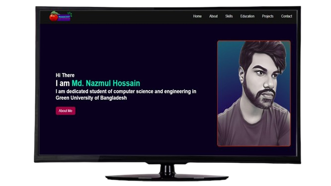
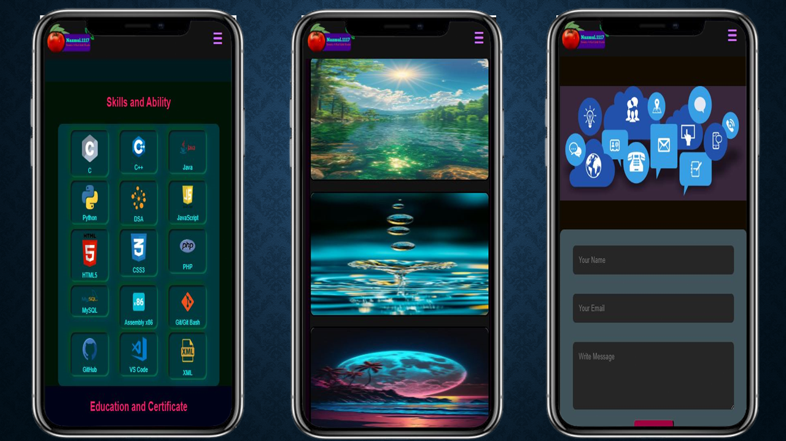

<a id="readme-top"></a>

<!-- [![Contributors][contributors-shield]][contributors-url]
[![Forks][forks-shield]][forks-url]
[![Stargazers][stars-shield]][stars-url]
[![Issues][issues-shield]][issues-url]
[![Unlicense License][license-shield]][license-url]
[![LinkedIn][linkedin-shield]][linkedin-url] -->


<!-- PROJECT LOGO -->
<br />
<div align="center">
  <a href="https://nazmul-1117.github.io/">
    
  </a>

  <h3 align="center">Nazmul's Personal Portfolio</h3>

  <p align="center">
    An awesome README template to jumpstart your projects!
    <br />
    <a href="https://nazmul-1117.github.io/"><strong>Explore the Portfolio »</strong></a>
    <br />
    <br />
  </p>
</div>

# Nazmul's Personal Portfolio
This repository contains the source code and files for my personal portfolio website. The website is built using HTML, CSS, and JavaScript.

## Overview
The personal portfolio website showcases my skills, projects, and experiences as a Machine Learning Engineer. It serves as an online platform to highlight my work and provide information about my background and expertise.

<div align="center">



</div>

## Features
- **Home:** Introduces myself and provides a brief overview of my skills and interests.
- **About:** Details my professional background, education, and relevant experience.
- **Skills:** Lists the programming languages, frameworks, and tools I am proficient in.
- **Education:** List of my academic background, Online courses, certificate and perticipation related to my passion.
- **Projects:** Showcases the projects I have worked on, including descriptions, screenshots, and links to live demos or repositories.
- **Contact:** Offers various ways to get in touch with me, such as through email, social media, or a contact form.

<p align="right">(<a href="#readme-top">Back to Top</a>)</p>

## Tools and Technologies
![HTML5][html-shield] </br>
![css][css-shield] </br>
![js][js-shield] </br>
![xampp][vsc-shield] </br>
![github][github-shield] </br>

<p align="right">(<a href="#readme-top">Back to Top</a>)</p>

## Contributing
Contributions are what make the open source community such an amazing place to learn, inspire, and create. Any contributions you make are **greatly appreciated**.

If you have a suggestion that would make this better, please fork the repo and create a pull request. You can also simply open an issue with the tag "enhancement".
Don't forget to give the project a star! Thanks again!

```bash
git clone https://github.com/nazmul-1117/nazmul-1117.github.io.git
```
### Top contributors:

<a href="https://github.com/nazmul-1117/nazmul-1117.github.io/graphs/contributors">
  
</a>

<p align="right">(<a href="#readme-top">Back to Top</a>)</p>


## License
Code and documentation copyright 2024-2025 the [`Nazmul's Personal Portfolio`][contributors-url] . Code released under the MIT License.

 [](https://opensource.org/licenses/MIT) 
 [](LICENSE.txt)

<p align="right">(<a href="#readme-top">Back to Top</a>)</p>


<!-- CONTACT -->
# Contact
Md. Nazmul Hossain - [@nazmul_1117][x-url] - 223002089@student.green.ac.bd
Project Link: [Nazmul's Personal Portfolio][project-url]
<p align="right">(<a href="#readme-top">Back to Top</a>)</p>


<!-- Link -->
[html-shield]: https://img.shields.io/badge/HTML5-expert-fd73c4?logo=html5&logoColor=blue&labelColor=gray
[css-shield]: https://img.shields.io/badge/CSS-expert-faab18?logo=css3&logoColor=faab18
[js-shield]: https://img.shields.io/badge/JavaScript-beginner-00adb6?logo=javascript&logoColor=00adb6
<!-- [php-shield]: https://img.shields.io/badge/PHP-intermediate-0ca72c?logo=php&logoColor=0ca72c -->
<!-- [mysql-shield]: https://img.shields.io/badge/MySql-expert-605cfa?logo=mysql&logoColor=8afff5 -->
<!-- [ajax-shield]: https://img.shields.io/badge/AJAX-beginner-bd6efd?logo=jameson&logoColor=bd6efd -->
[vsc-shield]: https://img.shields.io/badge/VSCode-beginner-913721?logo=vscodium&logoColor=ff9aee
<!-- [xampp-shield]: https://img.shields.io/badge/Xampp-expert-54715d?logo=xampp&logoColor=fdff80 -->
[github-shield]: https://img.shields.io/badge/GitHub-expert-e9301c?logo=github&logoColor=black


[contributors-url]: https://github.com/nazmul-1117/nazmul-1117.github.io/graphs/contributors
[project-url]: https://github.com/nazmul-1117/nazmul-1117.github.io/
[x-url]: https://x.com/nazmul_1117